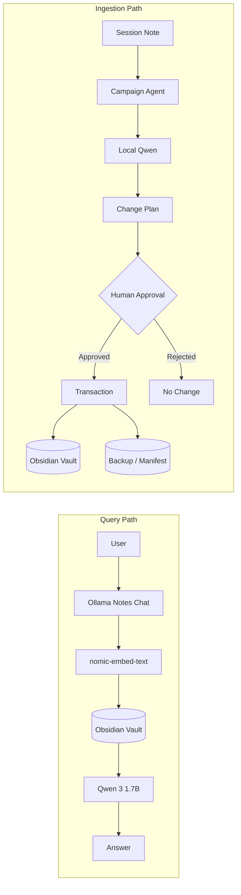
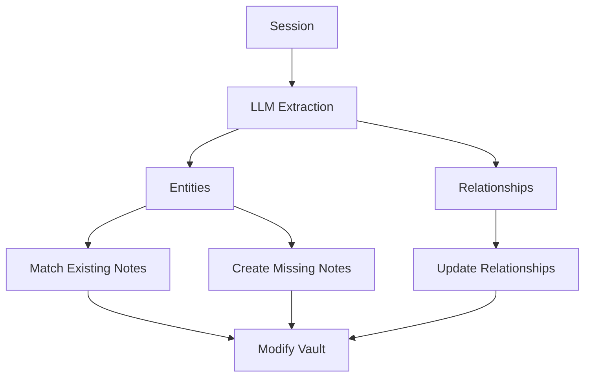
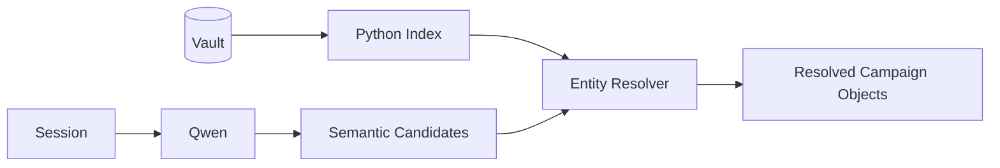
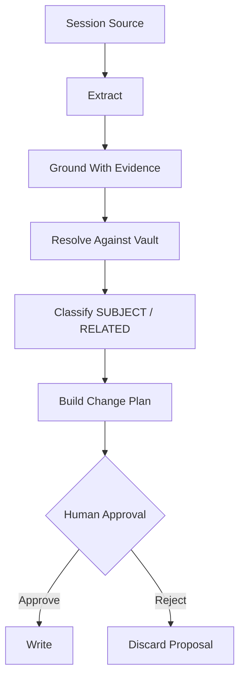
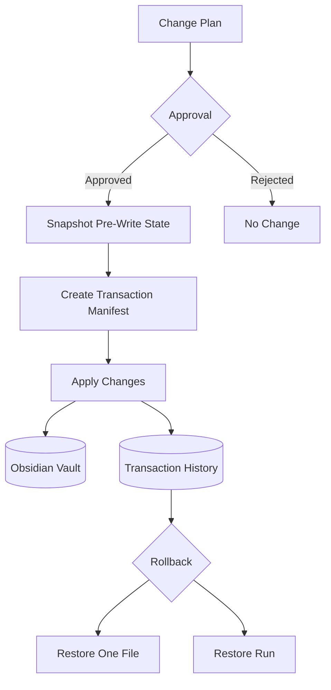
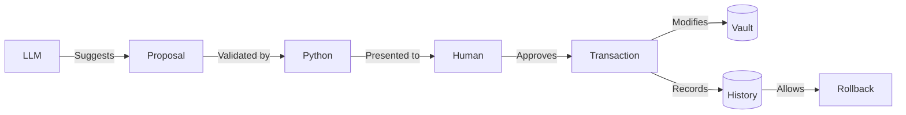
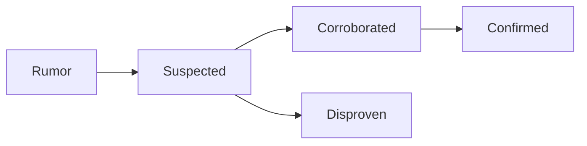
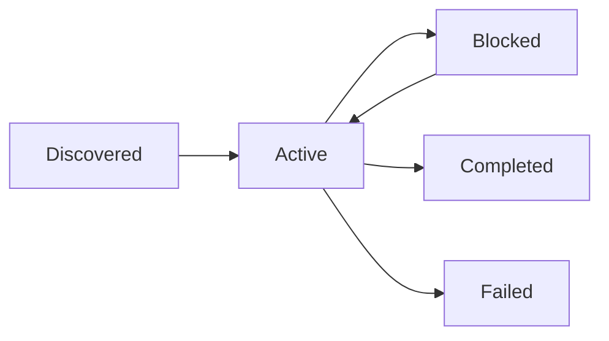
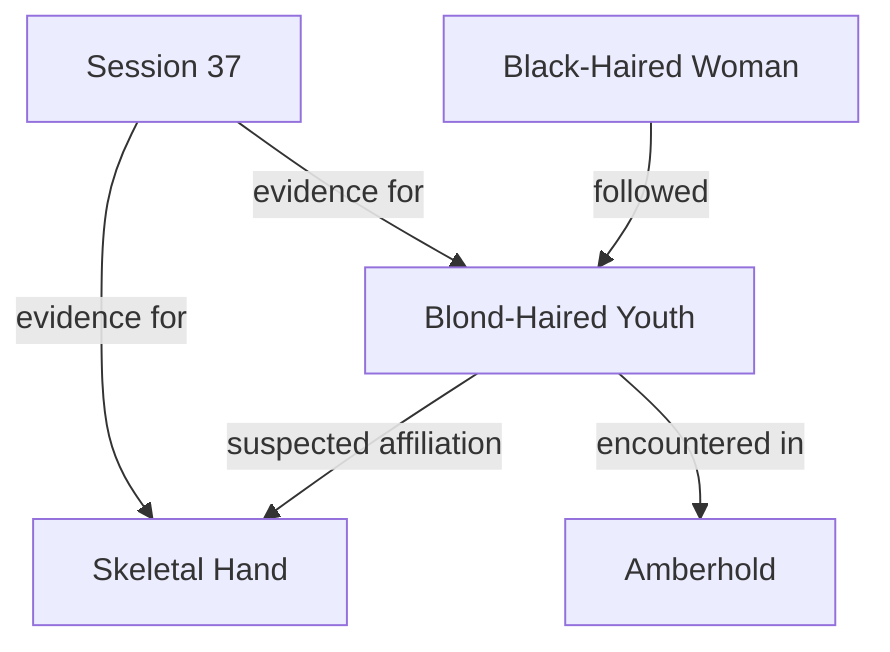

# Campaign Agent Architecture & Evolution

> **Current milestone:** V4.5.4  
> **Purpose:** Safely ingest D&D session notes into an Obsidian campaign vault using a local LLM while keeping campaign canon human-controlled, evidence-backed, and reversible.

## Overview

Campaign Agent began as an experiment in allowing a local LLM to help maintain an Obsidian-based D&D campaign vault.

The original idea was straightforward:

```text
Session Note
    ↓
LLM
    ↓
Find Entities & Relationships
    ↓
Create / Update Notes
    ↓
Obsidian Vault
```

Testing showed that while a small local model is good at **understanding campaign prose**, it is not reliable enough to directly administer the campaign knowledge base.

The architecture therefore evolved around a central principle:

> **The LLM may suggest campaign truth. It does not get to decide campaign truth.**

Today, Campaign Agent separates responsibilities between:

- **Qwen / Ollama** — semantic interpretation
- **Python** — deterministic resolution, validation, planning, and file operations
- **Human approval** — deciding what becomes campaign canon
- **Obsidian** — canonical human-readable knowledge base

---

# Current Architecture

There are now two intentionally separate AI workflows.



This separation is deliberate.

**Ollama Notes Chat** answers questions about existing campaign knowledge.

**Campaign Agent** proposes changes to that knowledge.

The chatbot does not administer the vault, and the ingestion agent is not intended to replace the RAG chatbot.

---

# How We Got Here

## Phase 1 — Local AI Foundation

The first goal was simply to make the campaign vault usable with a completely local AI stack.

The selected stack became:

```text
Obsidian
   ↓
Ollama
   ├── qwen3:1.7b
   └── nomic-embed-text
```

`qwen3:1.7b` was selected because it performs acceptably on the Intel Mac while remaining responsive enough for interactive use.

`nomic-embed-text` handles semantic retrieval.

Ollama Notes Chat became the primary conversational interface because it could retrieve relevant passages from the vault before sending them to Qwen.

This established the first important architectural distinction:

> **Retrieval and ingestion are different problems.**

---

# Phase 2 — The Original Campaign Agent

The first Campaign Agent design was ambitious.



The goal was to allow the model to:

1. Discover entities.
2. Determine entity types.
3. Discover relationships.
4. Match entities against existing notes.
5. Create missing notes.
6. Add wikilinks.
7. Update metadata.
8. Add reverse relationships.

Testing exposed a major problem.

A small local model could understand the session surprisingly well, but it was not reliable enough to make deterministic database decisions.

This led to a fundamental architectural change.

---

# Phase 3 — Move Authority From the LLM to Python

V2 and V3 progressively reduced the LLM's authority.

Instead of asking Qwen:

> What note does this entity correspond to?

Python began building an index from:

- filenames
- YAML metadata
- aliases
- existing vault structure

Qwen increasingly answered only:

> What appears to be present in this session?

Python then determined:

> What existing vault object does that correspond to?



This division remains central to the current architecture.

### Responsibility Boundary

| Component | Responsibility |
|---|---|
| Qwen | Interpret prose |
| Python | Resolve identities |
| Python | Validate paths/types |
| Python | Determine file operations |
| Human | Decide whether semantic information becomes canon |

---

# Phase 4 — Campaign-State Extraction

V4 changed the extraction problem.

Instead of asking the model for a loosely structured list of entities and relationships, extraction was divided into focused passes.

The major categories became:

```text
Entities
Quests / Objectives
Clues / Mysteries
Lore / World Knowledge
Developments
Rumors / Reported Claims
Open Questions
TODOs
```

TODO extraction became primarily deterministic rather than model-driven.

This allowed the system to start representing **campaign state** instead of merely identifying nouns in a session.

---

# Phase 5 — Evidence Grounding

A major weakness remained.

An LLM can produce a completely plausible summary that subtly changes what actually happened.

The solution introduced during V4.4 was **source evidence**.

Instead of storing only:

```text
The blond-haired youth may be connected to the Skeletal Hand.
```

the planner could also preserve the source passages that led to that conclusion.

Conceptually:

```text
Session Source
      ↓
Evidence Window
      ↓
Model Interpretation
      ↓
Campaign-State Proposal
```

This created an important distinction between:

### Source-grounded information

Information directly supported by session text.

### Model interpretation

A semantic inference made by the model that requires additional scrutiny.

By **V4.4.5**, extraction quality was considered stable enough to freeze as a baseline.

Development shifted from improving extraction to controlling what happens **after extraction**.

---

# Phase 6 — The Safe Change Planner

V4.5 introduced the most significant architectural shift.

The question changed from:

> Can the AI extract campaign information?

to:

> Under what circumstances should extracted information be allowed to alter campaign canon?

V4.5.0 introduced a read-only change plan.

```text
UPDATE EXISTING

  [[Deanira]]
      ADD SESSION HISTORY
      ADD CLUE

CREATE NEW

  Samuel Patel [npc]

REVIEW

  Blond-Haired Youth [npc]

IGNORE

  Generic / low-value entities
```

The agent could explain what it wanted to do **before touching the vault**.

---

# SUBJECT vs RELATED

V4.5.1 and V4.5.2 introduced another critical distinction.

An entity appearing near a fact does not necessarily mean that fact belongs in that entity's note.

Information is therefore classified as either:

### SUBJECT

The entity is actually the subject of the information.

Eligible for a semantic update.

### RELATED

The entity appears in the context but should not automatically receive the information.

Not eligible for automatic semantic updates.

For example:

```text
Deanira investigates the mysterious island.
```

may justify updating Deanira.

But:

```text
Deanira was present while the party discussed missing sanitation workers.
```

does not necessarily mean the sanitation-worker quest belongs in `Deanira.md`.

This significantly reduced false-positive writes.

---

# Deterministic Session History

Session participation was separated from semantic campaign knowledge.

An entity can safely receive:

```markdown
## Session History

- [[Session_37]]
```

without automatically receiving every fact mentioned during that session.

This distinction allows the graph to show that an entity appeared in a session without claiming that every event in the session belongs to that entity.

---

# Phase 7 — Controlled Writes

V4.5.3 allowed the planner to begin writing to the vault.

However, semantic changes became individually approved operations.

The ingestion pipeline became:



Deterministic operations such as Session History can default to approval.

Semantic operations default to rejection.

This intentionally biases the system toward **not modifying campaign canon unless explicitly authorized**.

---

# Phase 8 — V4.5.4 Transaction Safety

Human approval alone is not enough.

A user can approve something and later discover that it was incorrect.

V4.5.4 therefore added transactional writes.

The current write pipeline is:



Each real write run receives a unique transaction ID.

Example:

```text
20260923_205339_487823
```

The backup structure is conceptually:

```text
_backups/
└── runs/
    └── 20260923_205339_487823/
        ├── manifest.json
        └── before/
            ├── Sessions/
            │   └── Session_37.md
            ├── People/
            │   └── Deanira.md
            └── Places/
                └── The Two Tits.md
```

The manifest records which files were:

- modified
- created
- associated with the source session

---

# Rollback

V4.5.4 supports selective rollback.

```bash
python3 campaign_agent_v4_5_4.py \
    --rollback-file "Places/The Two Tits.md"
```

The user can choose a transaction:

```text
Available pre-modification versions:

[1] before run 20260923_205339_487823
[c] cancel
```

and restore the file to its pre-transaction state.

Whole-run rollback is also supported:

```bash
python3 campaign_agent_v4_5_4.py \
    --rollback 20260923_205339_487823
```

Selective rollback has been successfully tested.

---

# V4.5.4 Responsibility Model

The current system can be summarized as:



Or more simply:

```text
LLM
 │
 │ interpret
 ▼
Python
 │
 │ validate
 ▼
Human
 │
 │ authorize
 ▼
Transaction
 │
 │ safely mutate
 ▼
Obsidian
```

The architectural trend across development has therefore been:

```text
LLM authority          ↓

Deterministic control  ↑
Human control          ↑
Evidence requirements  ↑
Auditability           ↑
Reversibility          ↑
```

---

# Features Deliberately Deferred

Several capabilities have intentionally **not** been implemented yet.

They should not be considered forgotten features. They are potential future layers that were deferred until the ingestion foundation became trustworthy.

## 1. Typed Relationships

Early versions attempted relationship extraction.

For example:

```yaml
relationships:
  - target: [[Skeletal Hand]]
    type: member
```

This was removed because campaign relationships frequently contain uncertainty.

These statements are not equivalent:

```text
Furgus saw a Skeletal Hand tattoo.

The party suspects the man belongs to the Skeletal Hand.

The man belongs to the Skeletal Hand.
```

A future relationship system should therefore support evidence and epistemic state.

For example:

```yaml
relationships:
  - target: [[Skeletal Hand]]
    relation: suspected affiliation
    status: unconfirmed
    source: [[Session_37]]
```

---

## 2. Agent-Side RAG

Ollama Notes Chat currently uses embeddings to retrieve campaign knowledge.

Campaign Agent does not yet use the same mechanism during ingestion.

A future ingestion might encounter:

```text
The blond man appears again.
```

and retrieve previous passages concerning:

```text
Blond-Haired Youth
Skeletal Hand
Amberhold
previous tattoo sightings
```

before proposing an identity.

This would provide **campaign memory during ingestion**.

---

## 3. Knowledge Lifecycle

Campaign knowledge currently mostly accumulates.

Real campaign knowledge changes state.

For example:



Similarly:

```text
Open Question
      ↓
Investigated
      ↓
Resolved
```

A future agent could recognize that Session 42 resolves a mystery introduced in Session 37 rather than simply adding another paragraph.

---

## 4. Quest Lifecycle

Quest state could eventually become explicit:



The agent could then propose state transitions rather than simply adding quest-related prose.

---

## 5. Provenance Graph

Evidence grounding provides the beginning of a provenance system.

Eventually a durable fact could track:

```yaml
source: [[Session_37]]
provenance: source-grounded
evidence: "..."
created_at: ...
supersedes: ...
```

This would allow questions such as:

> Why do we believe the Blond-Haired Youth is associated with the Skeletal Hand?

to be traced through:

```text
Campaign Fact
     ↓
Evidence
     ↓
Session
     ↓
Original Source Text
```

---

## 6. Automatic Session Restructuring

Campaign Agent deliberately does **not** heavily rewrite raw session notes.

This preserves sessions as historical source records.

The current philosophy is:

> Session notes are evidence. Derived campaign notes are interpretations of that evidence.

Maintaining this distinction improves provenance and rollback.

---

## 7. Autonomous Folder Monitoring

Automatic processing of new files was considered but deliberately rejected.

The current workflow remains explicit:

```bash
python3 campaign_agent_v4_5_4.py \
    "Sessions/Session_38.md"
```

This keeps ingestion intentional and observable.

Automation can be added later without changing the underlying architecture.

---

# Potential Future Knowledge Graph

The long-term architecture could move beyond Markdown links into typed campaign relationships.



This could eventually expose:

- faction networks
- NPC relationships
- unresolved mysteries
- evidence chains
- quest dependencies
- contradictions
- historical knowledge changes

At that point, the Obsidian graph would represent more than files linking to files.

It would represent an actual **campaign knowledge graph**.

---

# Current Design Principle

V4.5.4 should not be viewed as the final Campaign Agent.

It represents the point at which the ingestion foundation became trustworthy enough to build more sophisticated features on top of it.

The current philosophy is:

> **LLMs interpret.**
>
> **Python validates.**
>
> **Humans authorize.**
>
> **Transactions protect.**
>
> **Obsidian remembers.**

---

# Current Status

**Stable / demonstrated**

- Local Ollama inference
- Obsidian RAG
- Focused campaign-state extraction
- Deterministic entity resolution
- Source evidence grounding
- SUBJECT vs RELATED classification
- Read-only change planning
- Per-change human approval
- Deterministic Session History
- Controlled note creation
- Transaction manifests
- Pre-modification backups
- Selective file rollback
- Repeat-run idempotency

**Deferred / future work**

- Rollback conflict detection
- Transaction hashes
- Rollback audit records
- Agent-side RAG
- Typed relationships
- Knowledge-state transitions
- Quest lifecycle management
- Contradiction detection
- Rich provenance
- Normalized extraction input
- Knowledge-graph layer
- Optional automation

---

## Version Evolution

```text
Initial Idea
    │
    ▼
Local Ollama + Obsidian RAG
    │
    ▼
Campaign Agent V1
LLM-heavy automation
    │
    ▼
V2–V3
Python entity resolution
    │
    ▼
V4.x
Campaign-state extraction
    │
    ▼
V4.4.x
Source grounding
    │
    ▼
V4.4.5
Extraction baseline frozen
    │
    ▼
V4.5.0
Read-only change planner
    │
    ▼
V4.5.1–V4.5.2
SUBJECT vs RELATED
    │
    ▼
V4.5.3
Controlled writes
    │
    ▼
V4.5.4
Transactions + rollback
    │
    ▼
     ?
```

The next version should build on this foundation rather than increasing LLM autonomy.